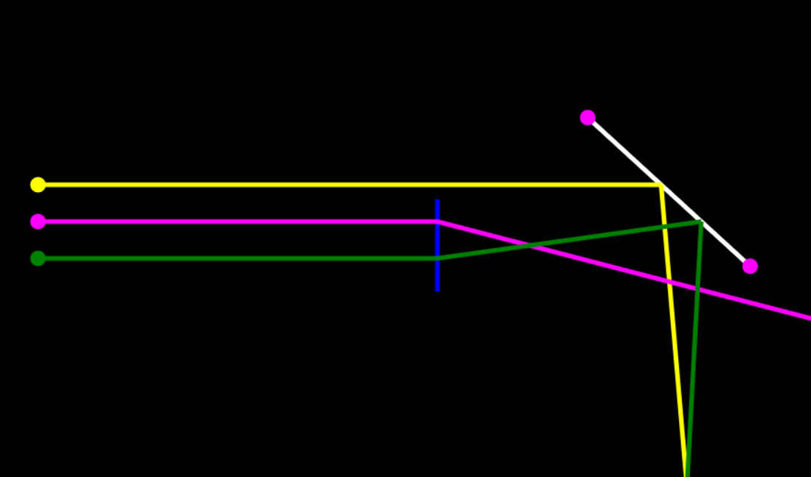

# Light ray sandbox

Trivial implementation of light ray sandbox with 1 mirror and 1 lens.

Implemented with Rust (WASM).

## Features

* Switch rays on/off and change their angle.

* Customizable focal length.

* Each ray has different color.

## Screenshot 
